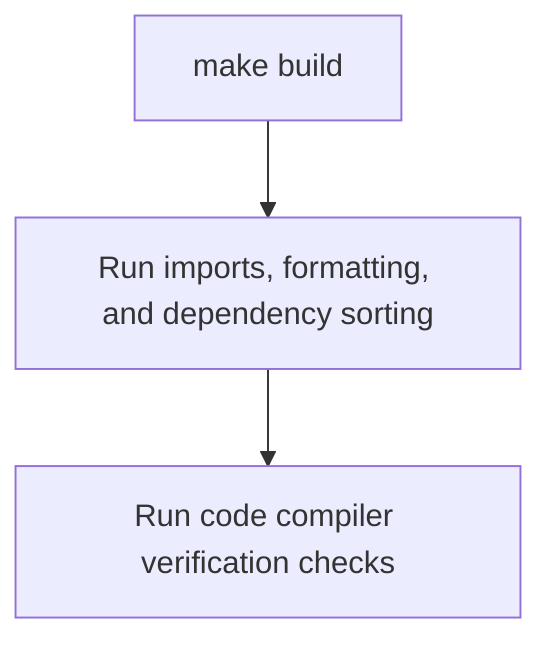

# GCSFuse Build and Style Verification Skill

This skill provides a highly streamlined workflow for Antigravity agents to compile the GCSFuse codebase, verify layout formats, resolve imports, and perform static analysis checks. Executing this unified validation runbook ensures all changes are cleanly compiled and formatted exactly to the repository's strict standards before proposing pull requests.

---

## 1. Context and Target Standards

GCSFuse uses a strict presubmit verification pipeline to ensure code hygiene and layout correctness. The root-level [Makefile](../../../Makefile) is the single-source-of-truth configuration orchestrator.

Running `make build` automatically handles the entire verification chain. Agents must not execute individual compilation or formatting steps manually unless explicitly instructed by this runbook.



Executing `make build` automatically executes and verifies the following operations:
* **Code Generation**: Triggers `go generate` to build auto-generated structures.
* **Auto-Imports & Formatting**: Automatically runs `goimports` and `go fmt` to align headers and style of all updated files.
* **Dependency Hygiene**: Runs `go mod tidy` to clean up and sync local package lists.
* **Static Analysis Checks**: Runs `go vet` to intercept logical and syntax issues early.
* **Style Compliance**: Runs `golangci-lint` to check code cleanliness against `master`.
* **Binary Compilation**: Builds all target packages under the root directory.

---

## 2. Step-by-Step Verification Workflow

### Step 1: Align Go Toolchain
1. Inspect the targeted Go compiler version specified in the root [.go-version](../../../.go-version) file (currently **`1.26.3`**).
2. Check the active compiler version:
   ```bash
   go version
   ```
3. If there is a major/minor version mismatch with the target baseline series, notify the user immediately before compiling, as version mismatches can introduce syntax regressions.

### Step 2: Run Unified Verification Target
Run the comprehensive validation suite from the root of the workspace:
```bash
make build
```
* **Verification Success**: The build target finishes with exit code `0`.
* **Verification Failure**: If the build target fails, analyze the output:
  * **Compilation/Syntax Errors**: Correct the source files and re-run `make build`.
  * **Lint Issues**: Resolve style warnings flagged by the linter.

### Step 3: Stage & Commit Automatic Formatting
Because `make build` runs auto-formatters and import organizers in-place, the workspace might receive automatic layout corrections.

1. Inspect the working tree for any modifications automatically made by the build:
   ```bash
   git status
   ```
2. Inspect formatting diffs:
   ```bash
   git diff --exit-code --name-only
   ```
3. **Commit Rule**: If formatting changes exist, **commit these automatic corrections** directly alongside your functional changes. Clean formatting is a mandatory PR check block.

---

## 3. Graceful Warning Fallbacks

### Style Linters Failure
`golangci-lint` is required under the `make build` pipeline. In sandboxed or offline local developer environments, this check can occasionally fail or time out:
* > [!WARNING]
* > Do **NOT** treat local linter warnings or execution failures as a blocking compilation failure.
* If standard compiling passes but the linter blocks execution, log a warning to the user noting that linting was bypassed, and proceed.

---

## 4. Compilation Verification Checklist

Before final project handoff, verify the following checks:

- [ ] **Toolchain Sync**: My active `go version` aligns with the project’s [.go-version](../../../.go-version) file directive.
- [ ] **Verification Clean**: Successfully compiled using `make build` without errors.
- [ ] **Hygiene Staged**: Any auto-formatting, import sorting, or dependency adjustments made by the Makefile are committed to the branch tree.
