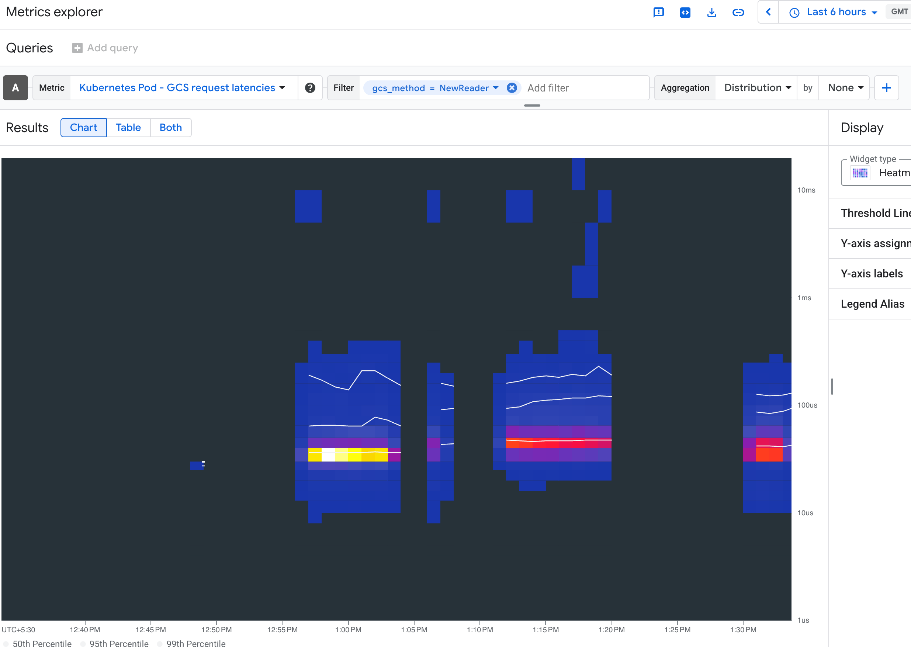

# GCSFuse Metrics Debugging Playbook

This playbook provides a guide on how to use GCSFuse metrics for debugging performance issues and errors.

## Introduction
GCSFuse metrics provide deep visibility into the file system's behavior and its interaction with Google Cloud Storage. By monitoring these metrics, you can:
- **Identify Performance Bottlenecks:** Distinguish between network latency, GCS API latency, and local processing delays.
- **Optimize Configuration:** Tune GCSFuse flags (like caching or concurrency) based on observed throughput and operation counts.

## Prerequisites
To use metrics for debugging, you must first enable and configure them.

Please refer to the official documentation for detailed instructions on setting up Cloud Storage FUSE metrics:
[Cloud Storage FUSE Metrics Guide](https://docs.cloud.google.com/storage/docs/cloud-storage-fuse/metrics)

## Common Debugging Scenarios

### High Latency
If you observe slow file operations, check `gcs/request_latency`:

1.  **Filter by `method`:** Look at specific methods like `NewReader` (read) or `CreateObject` (write).
2.  **Analyze `NewReader` Latency:**
    *   The following image shows an example of how to filter for `NewReader` latency in the metrics explorer.
        

    *   If `NewReader` latency is high, say higher than 300ms within the same region, it suggests a delay in establishing the connection or receiving the first byte.
    *   **Potential Causes:**
        *   High network latency between the client and GCS.
        *   DNS resolution issues.
        *   GCS server-side delays.
    *   **Next Steps:**
        *   To find the root cause of high `NewReader` latency, enable tracing as described in the [GCSFuse Tracing Guide](tracing.md)
        *   Alternatively, you can reach out to GCP customer support for assistance.