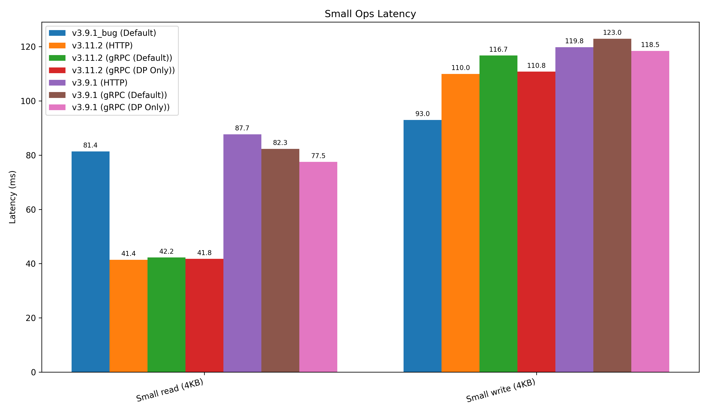
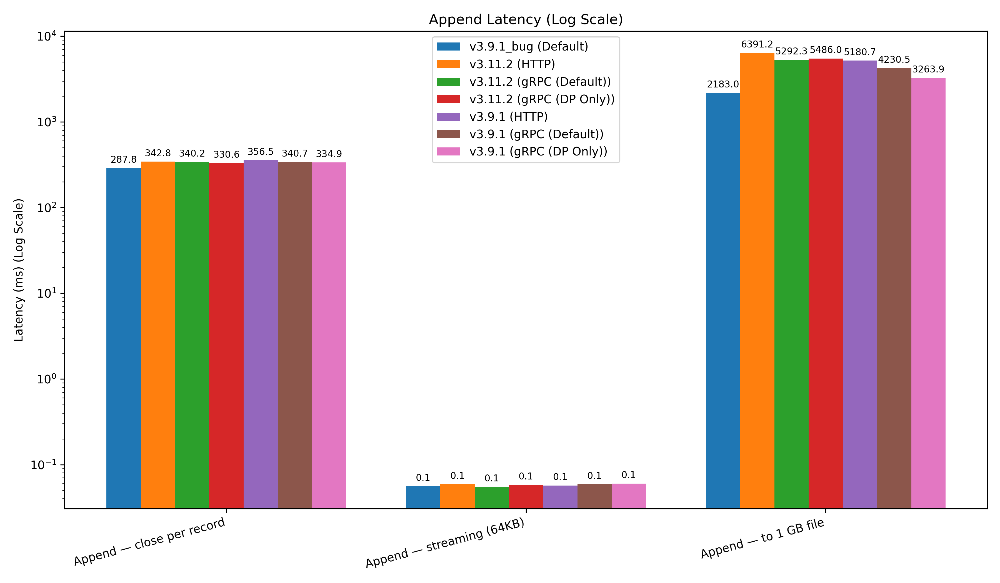
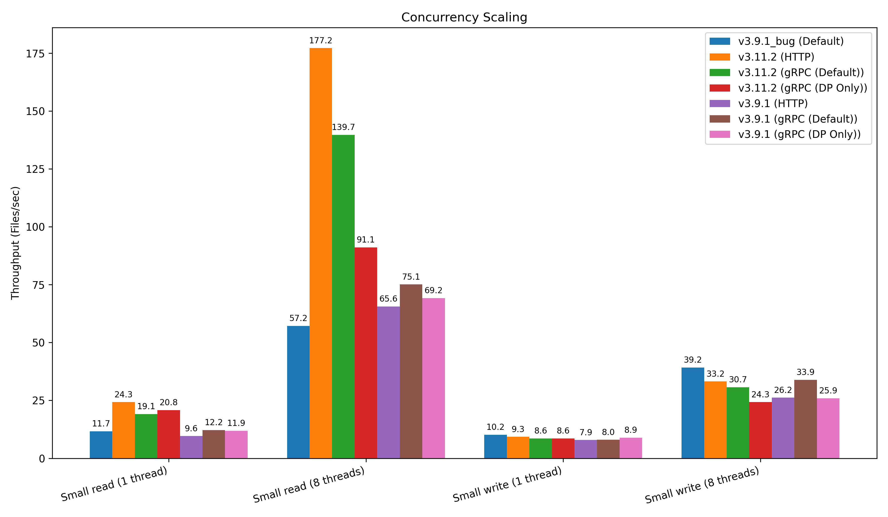
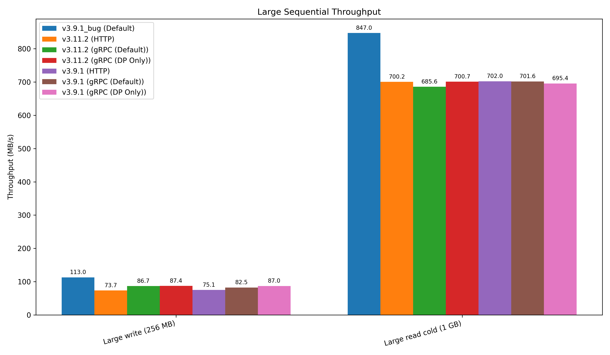

# GCSFuse Benchmark Results (Protocol Comparison)

This document summarizes the results of the GCSFuse performance benchmarks across different versions and protocol configurations (**HTTP**, **gRPC Default**, and **gRPC DirectPath Only**).

The goal is to compare performance against the baseline reported in the original issues and track improvements or regressions.

> [!IMPORTANT]
> **Results are now saved in a unified CSV format in the `results/` directory for better programmatic analysis.**
> -   [`benchmark_results.csv`](results/benchmark_results.csv): Contains results for all versions and protocols, with operations as separate columns.

### 📊 Benchmark Categories Tracked
1.  **Latency Operations:** Small reads/writes (4KB), Appends (various sizes).
2.  **Concurrency Scaling:** Small reads/writes across 1 vs 8 threads.
3.  **Large Sequential Throughput:** 256MB writes, 1GB reads.

### 📈 Visualizations
You can generate/update these plots by running `python3 scripts/plot_results.py`.
-   **Small Ops Latency:** 
-   **Append Latency:** 
-   **Concurrency Scaling:** 
-   **Sequential Throughput:** 

### Key Takeaways & Analysis

1. **V3.11.2 vs V3.9.1 (The True Comparison)**:
   - **Reads:** v3.11.2 is **significantly faster** on reads (both latency and concurrency) compared to our local run of v3.9.1. Small read latency dropped from ~80ms to ~40ms.
   - **Writes/Appends:** v3.11.2 actually shows **higher latency** for small writes and appends compared to v3.9.1 in our environment. The 1GB Append penalty was better in v3.9.1 (~3.2s - 5.1s) than in v3.11.2 (~5.2s - 6.3s).
2. **Protocol Parity for Small Ops**: For small 4KB reads and writes, protocol choice (HTTP vs gRPC) had minimal impact on median latency within the same version. All protocol variations were significantly faster on reads than the Buganizer baseline, confirming the benefits of modern Metadata Prefetching.
3. **The 1GB Append Penalty**: This remains the most protocol-sensitive metric. Under **HTTP**, closing a 1GB file after an append takes longer than under **gRPC**. However, the absolute numbers vary greatly between versions and runs, suggesting backend conditions play a large role.
4. **Throughput Caps**: Both versions and protocols peaked at similar throughputs (~70-87 MB/s write, ~700 MB/s read). This confirms that the bottleneck for large sequential I/O on this `c3-standard-8-lssd` VM is likely not the protocol stack or GCSFuse version, but VM-level or FUSE-level caps.
5. **DirectPath (DP) Only vs Default**: Forcing `direct-path-only` behaved similarly to the default `direct-path-with-fallback` in terms of latency, but showed lower throughput in concurrent reads under high load.
