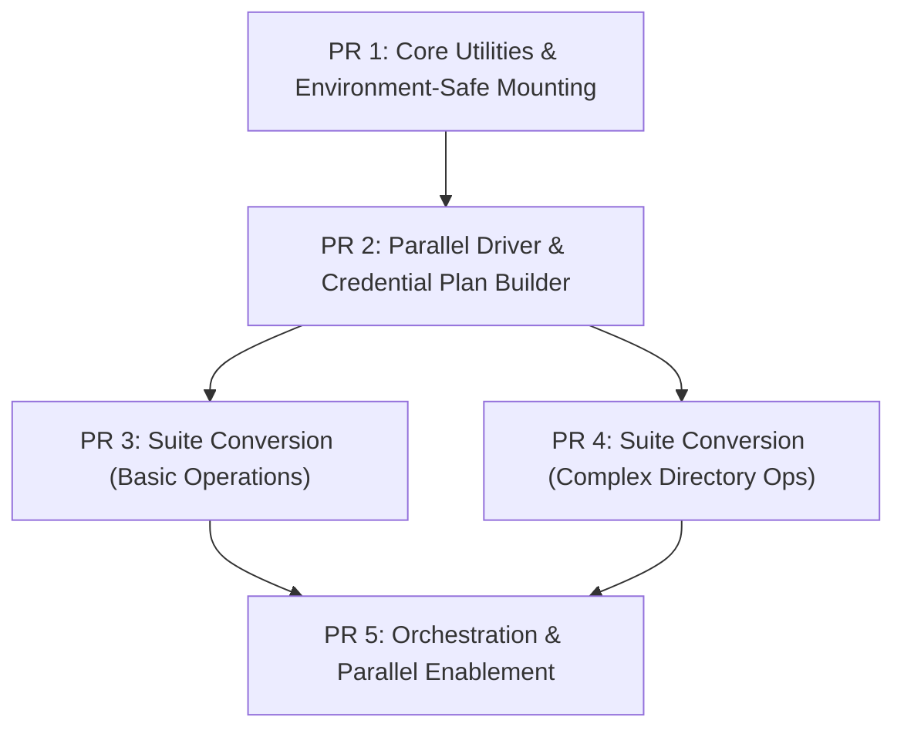

# Incremental PR Plan: Parallelize Integration Tests on FlagSets

This plan breaks down the parallelization and `testify/suite` migration of the `tools/integration_tests/operations/` package into **5 small, incremental, self-contained Pull Requests (PRs)**. 

Each PR can be independently reviewed, tested, and merged into `master` without breaking existing test workflows.

---

---

## PR 1: Core Framework - Environment-Safe Mounting & Setup Utilities
**Objective**: Extend core mounting functions to accept optional per-task environment variables (`Env map[string]string`) avoiding global `os.Setenv` mutations, and define core `AuthMode` enums.

### Changes Included
- **`tools/integration_tests/util/setup/setup.go`**:
  - Add `AuthMode` enum (`DefaultAuth`, `EnvVar`, `KeyFileOnly`, `EnvVarAndKeyFile`).
  - Add `GetSuiteMntDir` helper function.
- **`tools/integration_tests/util/mounting/`**:
  - Update `static_mounting`, `only_dir_mounting`, `persistent_mounting`, `dynamic_mounting`, and `mounting.go` to accept optional environment variable maps.
- **`tools/integration_tests/util/test_suite/config.go`**:
  - Add `Env map[string]string` field to `TestConfig`.

### Verification Strategy
Run existing integration tests sequentially; verify zero regressions in standard non-parallel test runs.

---

## PR 2: Parallel Driver Infrastructure & Credential Plan Generator
**Objective**: Introduce the `parallel` package driver (`parallel_driver.go`) and the credential plan builder (`creds_tests.BuildCredsExecutionPlan`).

### Changes Included
- **`tools/integration_tests/util/parallel/parallel_driver.go`** *(New File)*:
  - Add `RunConfiguration` struct with `MountType`, `AuthMode`, `Flags`, `MntDir`, `LogFile`, `IsolatedTaskDir`, and `Env`.
  - Add `BuildExecutionPlan` for compiling execution plans across FlagSets, MountTypes, and AuthModes.
  - Add `RunParallelTestDriver` for worker goroutine isolation and mounting.
- **`tools/integration_tests/util/creds_tests/creds.go`**:
  - Add `BuildCredsExecutionPlan` helper to encapsulate Service Account creation, IAM role assignment, 120s IAM sleep, and `t.Cleanup` teardown handlers.
- **`tools/integration_tests/util/client/`**:
  - Add isolated directory helpers (`SetupTestDirectory`, `DeleteAllObjectsWithPrefix`).

### Verification Strategy
Add unit tests for `BuildExecutionPlan` to verify plan generation logic and directory naming without running actual mounts.

---

## PR 3: Testify/Suite Migration - Phase 1 (Basic Operations Suites)
**Objective**: Convert 8 basic single-file operations tests to use `testify/suite` with `runCfg` struct fields.

### Changes Included
- **`tools/integration_tests/operations/copy_file_test.go`** (`CopyFileSuite`)
- **`tools/integration_tests/operations/create_three_level_dir_test.go`** (`CreateThreeLevelDirSuite`)
- **`tools/integration_tests/operations/delete_file_test.go`** (`DeleteFileSuite`)
- **`tools/integration_tests/operations/file_and_dir_attributes_test.go`** (`FileAndDirAttributesSuite`)
- **`tools/integration_tests/operations/move_file_test.go`** (`MoveFileSuite`)
- **`tools/integration_tests/operations/read_test.go`** (`ReadSuite`)
- **`tools/integration_tests/operations/rename_file_test.go`** (`RenameFileSuite`)
- **`tools/integration_tests/operations/stat_file_test.go`** (`StatFileSuite`)

### Verification Strategy
Run `go test -v ./tools/integration_tests/operations -run "TestCopyFile|TestRead..."` to verify suite compatibility.

---

## PR 4: Testify/Suite Migration - Phase 2 (Complex Directory & Write Suites)
**Objective**: Convert the remaining 6 complex directory and write operation tests to use `testify/suite`.

### Changes Included
- **`tools/integration_tests/operations/copy_dir_test.go`** (`CopyDirSuite`)
- **`tools/integration_tests/operations/delete_dir_test.go`** (`DeleteDirSuite`)
- **`tools/integration_tests/operations/list_dir_test.go`** (`ListDirSuite`)
- **`tools/integration_tests/operations/parallel_dirops_test.go`** (`ParallelDiropsSuite`)
- **`tools/integration_tests/operations/rename_dir_test.go`** (`RenameDirSuite`)
- **`tools/integration_tests/operations/write_test.go`** (`WriteTestSuite`)

### Verification Strategy
Run individual directory suites sequentially to verify directory setup and teardown assertions.

---

## PR 5: Orchestration & Parallel Driver Enablement
**Objective**: Enable top-level parallel execution for `TestOperations` and `TestOperationsCreds` using `RunParallelTestDriver`.

### Changes Included
- **`tools/integration_tests/operations/operations_test.go`**:
  - Clean up legacy global setup logic.
- **`tools/integration_tests/operations/parallel_driver_test.go`**:
  - Add `runOperationsSuites` helper function.
  - Enable `t.Parallel()` on `TestOperations` and `TestOperationsCreds`.
  - Wire up `BuildExecutionPlan` and `BuildCredsExecutionPlan`.

### Verification Strategy
Run `go test -v -parallel 64 ./tools/integration_tests/operations -run "TestOperations.*"` and verify 100% PASS with 20% speedup.
